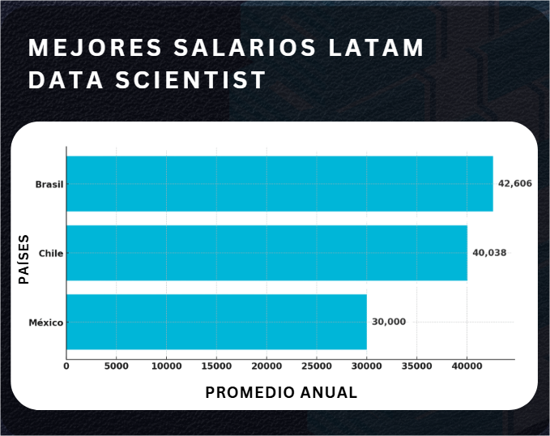
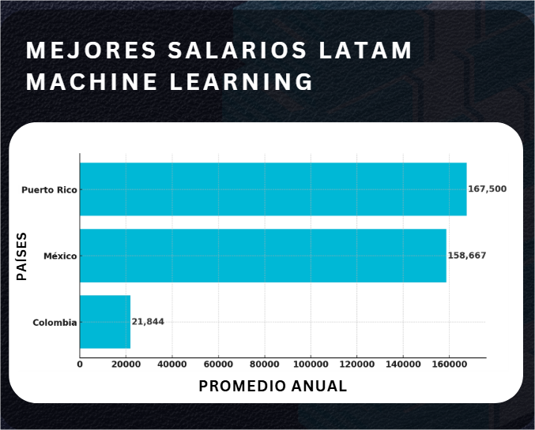
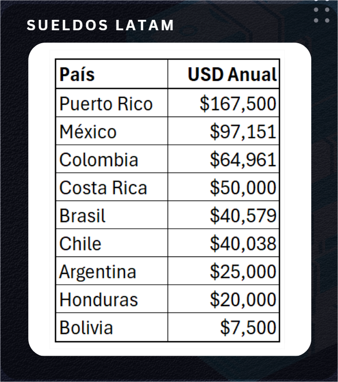

# DataScience-Salarios-Latam
# 💸 Mejores Sueldos en Data Science - LATAM (2025)

Análisis completo de salarios reales en Ciencia de Datos en América Latina.  
Incluye visualizaciones, comparación por país, roles técnicos y tabla resumen.  


---


## 📊 Contenido del proyecto

🔍 Dataset con más de **3.700 registros reales de salarios (2020–2023)**  
🌎 Enfoque exclusivo en **países de LATAM**  
👨‍💻 Comparativa de roles: *Data Scientist*, *Machine Learning*, *Data Engineer*, entre otros  
📈 Visualizaciones con **Matplotlib** (formato horizontal, simple y directo)  
📋 Tabla resumen con promedio salarial anual por país  
🧼 Limpieza de datos y clasificación de roles con **Pandas**

---

## 📁 Estructura del repositorio

📂 assets/ → Imágenes utilizadas en el README y redes sociales

📂 notebooks/ → Notebooks con el análisis (.ipynb)

📄 dataset_latam.csv → Dataset limpio y clasificado por rol

📄 README.md → Este archivo


---

## 📷 Visualizaciones destacadas

### 🥇 Top 3 - Data Scientist


### 🤖 Top 3 - Machine Learning


### 📋 Tabla de sueldos en LATAM


---

## 🚀 Cómo usar este repositorio

1. Clona este repositorio en tu entorno local:
```bash
git clone https://github.com/cristiangodoyangel/data-science-salarios-latam.git

Abre el notebook en Google Colab o Jupyter Notebook

Ejecuta el análisis o modifica los filtros según tus necesidades
```

## 🛠️ Tecnologías utilizadas
Python 3

Pandas

Matplotlib

Google Colab / Jupyter Notebook


## ✝️ Autor
Cristian Godoy Angel 

🌐 www.cristiangodoyangel.dev
📧 contacto@cristiangodoyangel.dev
🔗 [LinkedIn](https://www.linkedin.com/in/cristian-godoy-angel/)

⭐ Si este proyecto te fue útil, no olvides marcarlo con una estrella y compartirlo.
